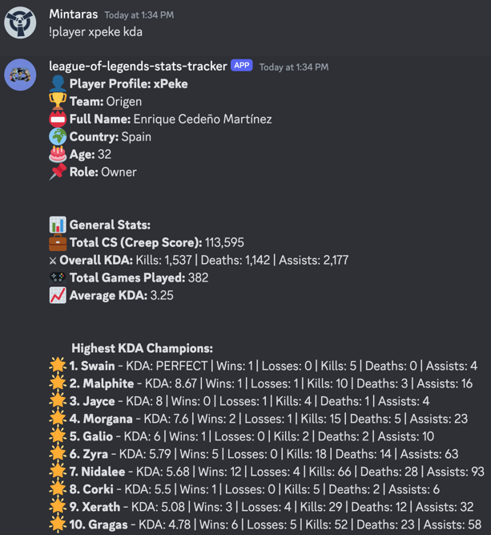

To start the Discord bot and understand its functionalities, follow the steps and explanations provided below:

## How to Start the Project

### Prerequisites
Ensure you have the following installed on your system:
- Node.js (v14 or higher)

### Steps to Start the Project

1. **Install Dependencies**:
   Open your terminal, navigate to the project directory, and run the following command:
   ```bash
   npm install
   ```
   This will install all the necessary dependencies listed in the `package.json` file.

2. **Configure the Bot**:
   Make sure your `config.js` file contains the correct token and prefix:
   ```javascript
   export const config = {
     token: "YOUR_DISCORD_BOT_TOKEN",
     prefix: "!player"
   };
   ```
   Replace `"YOUR_DISCORD_BOT_TOKEN"` with your actual Discord bot token.

3. **Start the Bot**:
   Run the following command to start the bot:
   ```bash
   npm start
   ```
   This will execute the `start` script defined in `package.json`, which runs the `src/discord.bot.js` file.

## How the Discord Bot Works

### Commands Overview

The bot listens for messages starting with the prefix defined in `config.js` (default is `!player`). Here are the main commands and their functions:

1. **Basic Player Stats**:
    - **Command**: `!player <nickname>`
    - **Description**: Retrieves basic stats for the player with the given nickname.
    - **Example**: `!player xpeke`
    - **Example result**: 

2. **Top 10 Best KDA Champions**:
    - **Command**: `!player <nickname> kda`
    - **Description**: Retrieves the top 10 champions with the best KDA for the player.
    - **Example**: `!player xpeke kda`
    - **Example result**: 

3. **Top 10 Most Played Champions**:
    - **Command**: `!player <nickname> most`
    - **Description**: Retrieves the top 10 most played champions for the player.
    - **Example**: `!player xpeke most`
    - **Example result**: 

4. **Advanced Options**:
    - **Command**: `!player <nickname> <option>:<min>:<max>`
    - **Description**: Allows advanced filtering with a minimum number of games (`min`) and the number of results (`max`).
    - **Example**:
        - KDA with at least 5 games: `!player xpeke kda:5`
        - Top 15 KDA champions with at least 5 games: `!player xpeke kda:5:15`
      - **Example result**: 

5. **Get Data in JSON Format**:
    - **Command**: `!player <nickname> <option> json`
    - **Description**: Retrieves the player data in JSON format.
    - **Example**: `!player xpeke kda:5:15 json`
    - **Example result**: 

### How to Use the Commands

When the bot receives a message, it checks if the message starts with the prefix. It then extracts the command and arguments from the message content.

**Example Interaction**:
- User sends: `!player xpeke kda:5:15`
- Bot processes the command, fetches the data, and responds with the formatted player data.

### Functions and Utilities

- **Utility Functions (`utils.js`)**:
    - `sendLongJson(channel, content)`: Sends large JSON content in chunks to avoid message length limits.
    - `sendLongMessage(channel, content)`: Sends long messages in chunks to avoid message length limits.
    - `formatPlayerDataForDiscord(data)`: Formats player data into a readable string for Discord.
    - `transformArrayToObject(arr)`: Transforms command arguments into a structured object.

- **Player Data Calculation (`playerData.js`)**:
    - `calculatePlayerData(data, extra)`: Calculates and formats player data.
    - Various helper functions to process and clean the data.

- **Bot Initialization and Message Handling (`discord.bot.js`)**:
    - Initializes the Discord client and sets up event listeners.
    - Handles incoming messages, parses commands, and responds with player data.

### Note

This project is a side project, and the code might not follow the best practices or be the cleanest. Please don't judge me if you don't like my sloppy coding style.

By following these instructions, you can start the bot and use its commands to fetch and display player statistics from League of Legends. The commands allow for both simple and advanced queries, providing flexibility in how the data is retrieved and displayed.

---